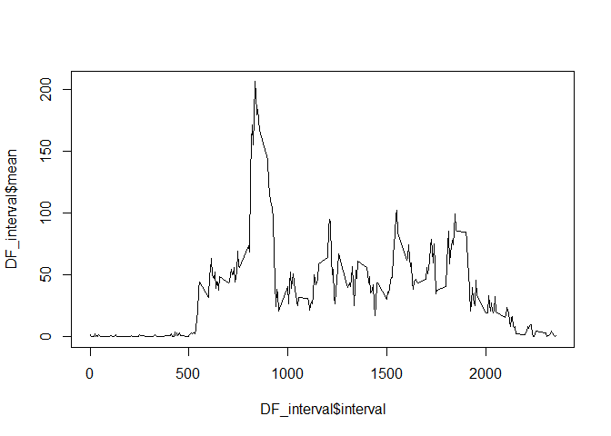
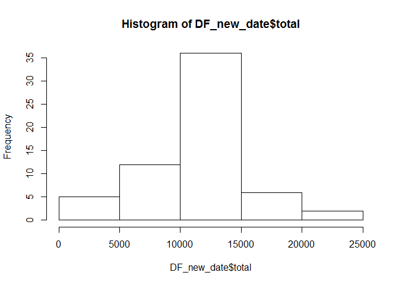

# Reproducible Research: Peer Assessment 1


## Loading and preprocessing the data

```r
DF <- read.table(unz("activity.zip", "activity.csv"), header=T, sep= ",")
DF$date <- as.Date(as.character(DF$date),"%Y-%m-%d")
```


## What is mean total number of steps taken per day?

```r
library(dplyr)
```

```
## 
## Attaching package: 'dplyr'
```

```
## The following objects are masked from 'package:stats':
## 
##     filter, lag
```

```
## The following objects are masked from 'package:base':
## 
##     intersect, setdiff, setequal, union
```

```r
DF_date <- summarize(group_by(DF,date),total = sum(steps,na.rm = T))
hist(DF_date$total)
```

\

```r
mean(DF_date$total,na.rm = T)
```

```
## [1] 9354.23
```

```r
median(DF_date$total,na.rm = T)
```

```
## [1] 10395
```


## What is the average daily activity pattern?

```r
library(dplyr)
DF_interval <- summarize(group_by(DF,interval),mean = mean(steps,na.rm = T))
plot(DF_interval$interval,DF_interval$mean,type="l")
```

\

```r
Max_steps_interval <- as.character(DF_interval[which.max(DF_interval$mean),1])
```

## Imputing missing values

```r
library(dplyr)
sum(is.na(DF$steps))
```

```
## [1] 2304
```

```r
DF_new <- merge(DF,DF_interval,by="interval")
DF_new$steps <- ifelse(is.na(DF_new$steps),DF_new$mean,DF_new$steps)
DF_new <- DF_new[,1:3]

DF_new_date <- summarize(group_by(DF_new,date),total = sum(steps,na.rm = T))
hist(DF_new_date$total)
```

\

```r
mean(DF_new_date$total)
```

```
## [1] 10766.19
```

```r
median(DF_new_date$total)
```

```
## [1] 10766.19
```

## Are there differences in activity patterns between weekdays and weekends?

```r
library(ggplot2)
library(dplyr)
weekdays <- c('Monday', 'Tuesday', 'Wednesday', 'Thursday', 'Friday')
DF_new$DayOfTheWeek <- factor((weekdays(DF_new$date) %in% weekdays), 
                   levels=c(FALSE, TRUE), labels=c('weekend', 'weekday'))
DF_new_interval <- summarize(group_by(DF_new,interval,DayOfTheWeek),mean = mean(steps,na.rm = T))
ggplot(DF_new_interval,aes(interval,mean))+geom_line()+facet_grid(DayOfTheWeek ~ .)
```

\
